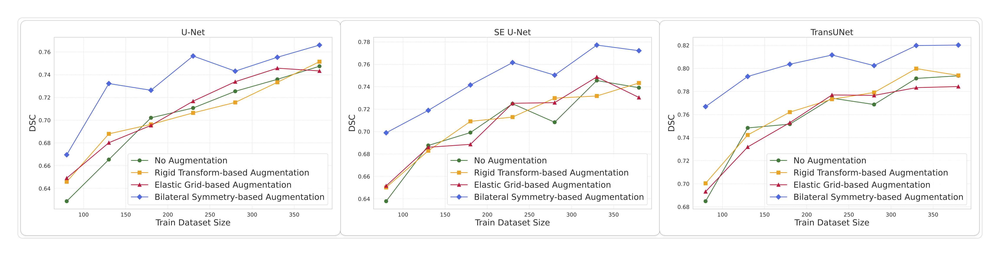

# Bilateral Symmetry-Based Data Augmentation for Tooth Segmentation in Panoramic X-rays

This repository contains the **official implementation** of the method proposed in the paper:

**Bilateral symmetry-based augmentation method for improved tooth segmentation in panoramic X-rays**  
Sanket Wathore, Subrahmanyam Gorthi  
*Pattern Recognition Letters*, 2025  

**Paper:** https://www.sciencedirect.com/science/article/abs/pii/S0167865524003362

This codebase enables full **reproducibility of the data preparation, augmentation, training, and evaluation pipeline** reported in the paper.

---

## 1. Problem Overview

Accurate tooth segmentation in panoramic dental X-rays is a challenging **32-class semantic segmentation problem** due to:

- high anatomical variability across patients,
- limited availability of pixel-level annotations,
- large number of labels per image, and
- structural similarity between adjacent teeth.

While collecting additional annotations is expensive and time-consuming, panoramic X-rays exhibit a strong **approximate bilateral symmetry** across the vertical midline of the dental arch. This repository leverages this domain-specific property to improve learning efficiency and segmentation accuracy.

---

## 2. Proposed Method: Bilateral Symmetry-Based Augmentation

The proposed augmentation strategy explicitly exploits the **bilateral symmetry of panoramic dental anatomy** to generate anatomically valid synthetic samples.

### Key Idea

Instead of applying generic random transformations, the method:

1. Learns quadrant-wise structure using a deep learning-based quadrant segmentation model.
2. Separates the image into left and right regions with respect to the symmetry axis.
3. Generates three synthetic samples per image by:
   - flipping only the right side,
   - flipping only the left side,
   - flipping both sides simultaneously.
4. Applies **careful filtering and tooth re-enumeration** to ensure label consistency (1–32) after flipping.

This results in a **4× increase in effective training data** while preserving anatomical realism.

The complete augmentation pipeline is illustrated in the paper (Fig. 2–4).

---

## 3. Dataset

### 3.1 Source

**DENTEX 2023 Tooth Enumeration Dataset**  
https://dentex.grand-challenge.org/data/

### 3.2 Description

- 634 panoramic dental X-rays
- Pixel-level annotations for 32 individual teeth
- Original FDI numbering converted to unified labels (1–32)
- Data split used in all experiments:
  - Training: 380 images
  - Validation: 127 images
  - Testing: 127 images

**Note:**  
The dataset is not distributed with this repository and must be obtained from the official DENTEX website.

---

## 4. Repository Structure

```
.
├── dentex_dataset/ # DENTEX dataset and generated segmentation masks
├── figures/ # Quantitative result plots
├── models/ # Model definitions
├── outputs/ # Training logs and Checkpoints
├── training_testing_scripts/ # Training and testing scripts
│
├── bilateral_symmetry_based_augmentation.py
├── elastic_grid_based_augmentation_train_range.py
├── rigid_transform_based_augmentation_train_range.py
├── process_dataset.py
├── split_train_val_test.py
├── split_train.py
│
├── requirements.txt
└── README.md
```

---

## 5. Environment Setup

Python **3.8 or later** is recommended.

Install dependencies using:

```bash
pip install -r requirements.txt
```

Tested with PyTorch 1.12.1 (CUDA 11.3). GPU support is recommended for training but not required for data augmentation.

---

## 6. Reproducible Experimental Pipeline

### 6.1 Dataset Preparation

```bash
python dataset_processing/process_dataset.py
```

Generates quadrant masks and 32-class tooth enumeration masks.

---

### 6.2 Train / Validation / Test Split

```bash
python dataset_processing/split_train_val_test.py
```

Creates a 60:20:20 split consistent with the paper.

---

### 6.3 Incremental Training Subsets

```bash
python dataset_processing/split_train.py
```

Creates training subsets of size:  
80, 130, 180, 230, 280, 330, and 380 images.

---

### 6.4 Data Augmentation

#### Bilateral Symmetry-Based Augmentation (Proposed)

```bash
python augmentation/bilateral_symmetry_based_augmentation.py
python augmentation/bilateral_symmetry_based_augmentation_train_range.py
```

#### Baseline Augmentations

```bash
python augmentation/rigid_transform_based_augmentation_train_range.py
python augmentation/elastic_grid_based_augmentation_train_range.py
```

---

### 6.5 Model Training

Models evaluated:
- U-Net
- SE U-Net
- TransUNet

```bash
bash training_testing_scripts/training_32_unet.sh
bash training_testing_scripts/training_32_seunet.sh
bash training_testing_scripts/training_32_transunet.sh
```

---

### 6.6 Model Evaluation

```bash
bash training_testing_scripts/testing_32_unet.sh
bash training_testing_scripts/testing_32_seunet.sh
bash training_testing_scripts/testing_32_transunet.sh
```

Metric: **Dice Similarity Coefficient (DSC)**

---

## 7. Quantitative Results

The figures below (available in the `figures/` directory) present the **Dice Similarity Coefficient (DSC)** achieved by U-Net, SE U-Net, and TransUNet models across increasing training dataset sizes (80 to 380 images) under four data augmentation strategies:
- No augmentation
- Rigid transform-based augmentation
- Elastic grid-based augmentation
- Bilateral symmetry-based augmentation (proposed)



Across all three architectures and all training set sizes, the proposed **bilateral symmetry-based augmentation consistently yields the highest DSC values**, outperforming both rigid transform-based and elastic grid-based augmentation methods.

As reported in the paper, the improvement is particularly significant in **low-data regimes**, demonstrating the effectiveness of the proposed method when annotated data is limited. For a training set of 80 images, the average DSC improves from:
- **0.6288 to 0.6696** for U-Net,
- **0.6379 to 0.6989** for SE U-Net, and
- **0.6849 to 0.7669** for TransUNet,

corresponding to approximate gains of **4%, 6%, and 8%**, respectively.

With increasing training data, the bilateral symmetry-based augmentation continues to provide consistent performance gains, achieving peak DSC values of **0.7660** (U-Net), **0.7721** (SE U-Net), and **0.8202** (TransUNet). Statistical analysis using paired t-tests confirms that these improvements are **highly significant** (*p* < 10⁻⁴⁴), validating the robustness and effectiveness of the proposed augmentation strategy.


---

## 8. Key Observations

- The proposed augmentation method consistently outperforms generic geometric augmentations.
- Performance gains are largest when training data is limited.
- Improvements are statistically significant.
- The method is architecture-agnostic and benefits CNN and Transformer-based models.

---

## 9. Citation

If you use this repository, please cite:

```bibtex
@article{wathore2025bilateral,
  title={Bilateral symmetry-based augmentation method for improved tooth segmentation in panoramic X-rays},
  author={Wathore, Sanket and Gorthi, Subrahmanyam},
  journal={Pattern Recognition Letters},
  year={2025},
  publisher={Elsevier}
}
```

---

## 10. Contact

Sanket Wathore  
Department of Electrical Engineering  
Indian Institute of Technology Tirupati  
Email: ee20b041@iittp.ac.in
