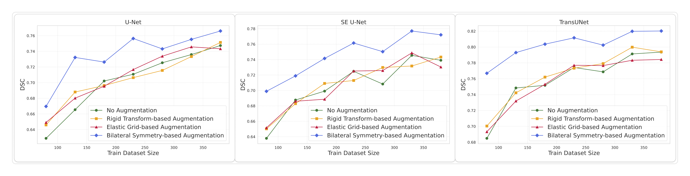

# Bilateral Symmetry-Based Data Augmentation for Tooth Segmentation in Panoramic X-rays

**Paper:** Bilateral symmetry-based augmentation method for improved tooth segmentation in panoramic X-rays  
**Authors:** Sanket Wathore, Subrahmanyam Gorthi  
**Published in:** Pattern Recognition Letters, Elsevier, 2025  
**Link:** https://www.sciencedirect.com/science/article/abs/pii/S0167865524003362

---

## Overview

Segmenting individual teeth in panoramic dental X-rays is a genuinely hard problem. Each image contains up to 32 teeth that need to be identified and labeled separately, and the available annotated datasets are small because creating annotations is expensive and time-consuming.

This project introduces a data augmentation strategy that takes advantage of a natural property of panoramic X-rays: the left and right halves of the dental arch are approximate mirror images of each other. By exploiting this bilateral symmetry, we can generate new, anatomically valid training samples from existing ones, effectively quadrupling the training dataset without collecting any new annotations.

The method is evaluated on three segmentation models (U-Net, SE U-Net, TransUNet) and consistently improves performance across all of them, with the biggest gains when the training set is small.

---

## How the Augmentation Works

The core idea is to split a panoramic X-ray along its vertical midline and flip one or both halves to produce new images. This yields three new samples per original image, giving a 4x increase in training data.

In practice, getting this right requires a few careful steps:

1. Run a quadrant segmentation model to locate the left and right sides of the dental arch precisely.
2. Split the image and its annotation mask along the midline.
3. Generate three augmented versions: flip only the left side, flip only the right side, and flip both sides.
4. Re-enumerate tooth labels after each flip to keep FDI numbering consistent (teeth 1 to 32).

The re-enumeration step is what makes this work properly. A naive horizontal flip would scramble the tooth labels and produce incorrect ground truth masks, so this step is not optional.

---

## Dataset

**DENTEX 2023 Tooth Enumeration Dataset**  
https://dentex.grand-challenge.org/data/

- 634 panoramic X-rays with pixel-level tooth annotations
- 32 individual tooth classes, using unified labels 1 to 32
- Split used in all experiments: 380 train / 127 val / 127 test

The dataset is not included in this repository. Download it from the official DENTEX website before running any scripts.

---

## Repository Structure

```
.
├── bilateral_symmetry_based_augmentation.py          # Augments the full training set (proposed method)
├── bilateral_symmetry_based_augmentation_train_range.py  # Same, across multiple dataset sizes
├── elastic_grid_based_augmentation_train_range.py    # Elastic grid baseline augmentation
├── rigid_transform_based_augmentation_train_range.py # Rigid transform baseline augmentation
├── process_dataset.py                                # Converts raw DENTEX data into quadrant and tooth masks
├── split_train_val_test.py                           # Creates the train/val/test split
├── split_train.py                                    # Creates incremental training subsets
├── train_unet.py                                     # Training script for U-Net
├── train_transunet.py                                # Training script for TransUNet
├── test_unet.py                                      # Evaluation script for U-Net
├── test_transunet.py                                 # Evaluation script for TransUNet
├── models/                                           # Model architecture definitions
│   ├── unet/
│   └── transunet/
├── training_testing_scripts/                         # Shell scripts for running full experiments
├── figures/                                          # Result plots from the paper
└── requirements.txt
```

---

## Setup

Python 3.8 or later is required. Install all dependencies with:

```bash
pip install -r requirements.txt
```

Tested with PyTorch 1.12.1 and CUDA 11.3. A GPU is strongly recommended for training. The augmentation and preprocessing scripts can run on CPU.

---

## Running the Full Pipeline

### Step 1: Prepare the dataset

Convert raw DENTEX annotations into quadrant masks and 32-class tooth segmentation masks:

```bash
python process_dataset.py
```

### Step 2: Create the data split

Divide the dataset into train, validation, and test sets (60/20/20 split):

```bash
python split_train_val_test.py
```

### Step 3: Create incremental training subsets

This creates training subsets of increasing size (80, 130, 180, 230, 280, 330, 380 images) so you can evaluate how performance scales with the amount of training data:

```bash
python split_train.py
```

### Step 4: Run augmentation

**Proposed method (bilateral symmetry):**
```bash
python bilateral_symmetry_based_augmentation.py
python bilateral_symmetry_based_augmentation_train_range.py
```

**Baseline augmentation methods (for comparison):**
```bash
python rigid_transform_based_augmentation_train_range.py
python elastic_grid_based_augmentation_train_range.py
```

### Step 5: Train models

```bash
bash training_testing_scripts/training_32_unet.sh
bash training_testing_scripts/training_32_seunet.sh
bash training_testing_scripts/training_32_transunet.sh
```

### Step 6: Evaluate models

```bash
bash training_testing_scripts/testing_32_unet.sh
bash training_testing_scripts/testing_32_seunet.sh
bash training_testing_scripts/testing_32_transunet.sh
```

The evaluation metric used throughout is the **Dice Similarity Coefficient (DSC)**.

---

## Results

The plot below shows DSC across all three models and all training set sizes, comparing bilateral symmetry augmentation against rigid and elastic baselines and no augmentation.



The proposed method outperforms all baselines across every model and dataset size combination. Some key numbers:

- At 80 training images, DSC improves by roughly 4% for U-Net, 6% for SE U-Net, and 8% for TransUNet.
- Peak DSC with bilateral symmetry augmentation: **0.7660** (U-Net), **0.7721** (SE U-Net), **0.8202** (TransUNet).
- Compared to rigid and elastic baselines specifically, the improvement is up to 5% in average DSC.
- Improvements are statistically significant across all models (paired t-test, p < 10^-44).

The gains are largest in low-data regimes, which is exactly where augmentation matters most.

---

## Citation

```bibtex
@article{wathore2025bilateral,
  title={Bilateral symmetry-based augmentation method for improved tooth segmentation in panoramic X-rays},
  author={Wathore, Sanket and Gorthi, Subrahmanyam},
  journal={Pattern Recognition Letters},
  year={2025},
  publisher={Elsevier}
}
```

---

## Contact

Sanket Wathore  
Department of Electrical Engineering  
Indian Institute of Technology Tirupati  
Email: ee20b041@iittp.ac.in
